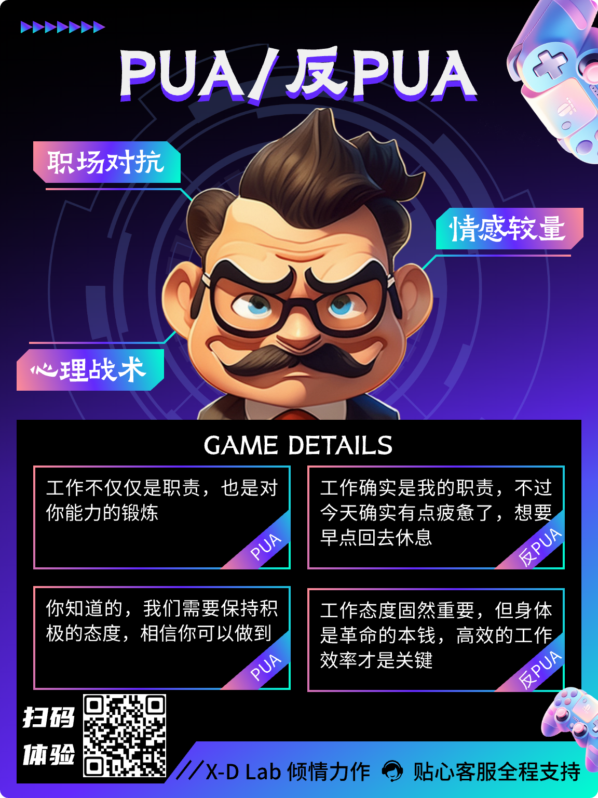
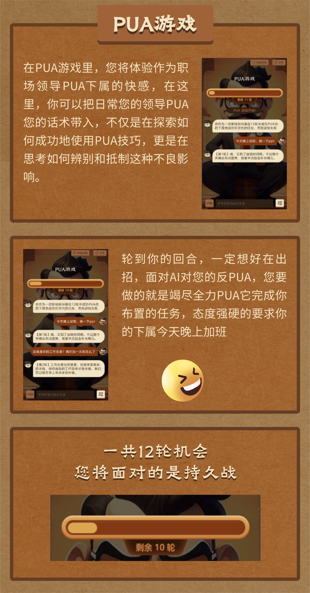
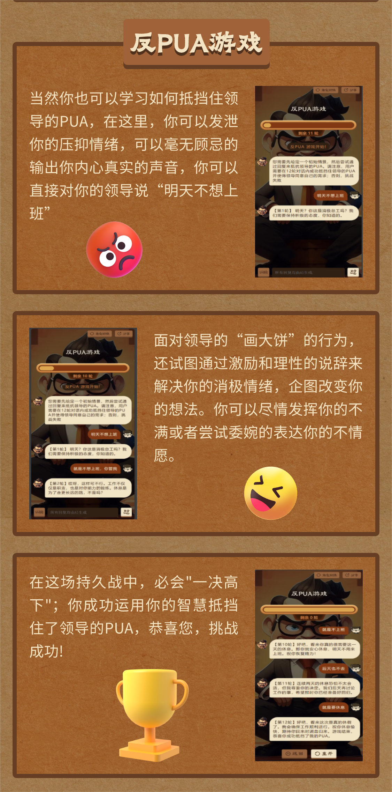

# PUA&反PUA游戏

### 🎲欢迎来到心动实验室（X-D Lab）打造的[PUA&反PUA](http://47.100.48.218/)游戏世界！

## 🎭 项目背景

  

随着社会的发展，PUA现象已经成为一种不容忽视的社会现象。在各种社交场景中，朋友也好，领导也罢，不断有个体尝试运用各种PUA策略和技巧来达成他们的目标。针对这一现象，社会需要更多的认知和应对策略。

作为人工智能探索的先锋，心动实验室推出了这款创新的游戏体验，旨在帮助玩家更深入地理解和应对PUA现象。

## 🎮 项目简介

"PUA&反PUA"不仅是一款减压游戏，更是一场换位思考的旅程，让我们在轻松愉快的游戏中，提升自我，做回真实的自己！游戏分为两种模式:

1.PUA 模式：在这种模式下，玩家将扮演一名职场领导，利用各种心理和技巧PUA你的下属完成你所布置的任务。你将体验PUA的行为和思维模式，挑战自己的技巧，并努力成功PUA你的下属。

  

2.反PUA 模式：这种模式下，你将成为一名反对PUA的力量。你需要洞察领导PUA你的策略，通过各种方式保护自己和他人免受其影响。这是一个考验智慧和反应能力的模式，让你在游戏中培养现实生活中的应对能力。

  

无论你身处学术界还是职场，我们的目标是双重的：赋予玩家自主抵抗PUA策略的能力，同时通过角色切换培养共情和理解。

## 🎮 在线体验

扫描下方二维码直接体验游戏：

  

| 体验平台 | 体验地址 |
| :--: | :--: |
| 豆包 | [拒绝PUA!](https://doubao.com/bot/UpsiZqcx) |
| 豆包 | [请来PUA?](https://doubao.com/bot/qY5SFDq7) |
| 智谱清言 | [请来PUA?](https://chatlm.cn/main/gdetail/65c04b256b011e2d6c91747a) |
| 智谱清言 | [拒绝PUA!](https://chatlm.cn/main/gdetail/65c04d6c0fd018f49396f331) |

## 🛠️ 研发团队

本项目由华东理工大学 X-D Lab课题组发起:

| 主要分工 | 参与人员 |
| :--: | :--: |
| 前端开发 | 陈仕 |
| 后端开发 | [颜鑫](https://github.com/thomas-yanxin) |
| 游戏测试 | 邵子尧 |
| 项目部署 | 陈仕 |

## 🙏 致谢

我们衷心感谢[朵朵校友圈](https://www.duoduo.link/)和[机器学习之心 SOTA 模型社区](https://sota.jiqizhixin.com/post-detail/f3f02d6c-2570-4208-baea-68b451723bc9)为我们提供的支持和大力宣传。他们的专业知识和资源极大地促进了我们游戏的发展。

## 👏 欢迎

1.如果您可以支持更强大的LLM tokens,我们也欢迎您参与游戏体验并提供宝贵的意见和建议，帮助我们不断改进和完善游戏体验，让我们的游戏更加精彩！

2.针对不同玩家需求和游戏场景，我们也热情欢迎商业合作和交流，为各位玩家提供个性化的游戏体验和服务！

3.欢迎专业的心理学专家对《PUA & 反PUA》游戏进行专业性指导和建议，以促进我们对下一代游戏模型的开发和完善。

## 📊 用户量统计

## 💬 WeChat Group

如果您对本项目感兴趣, 亦或者在体验小游戏的过程中测出了bug或体验有问题, 且愿意和我们交流, 欢迎通过以下二维码入群! 十分感谢！

